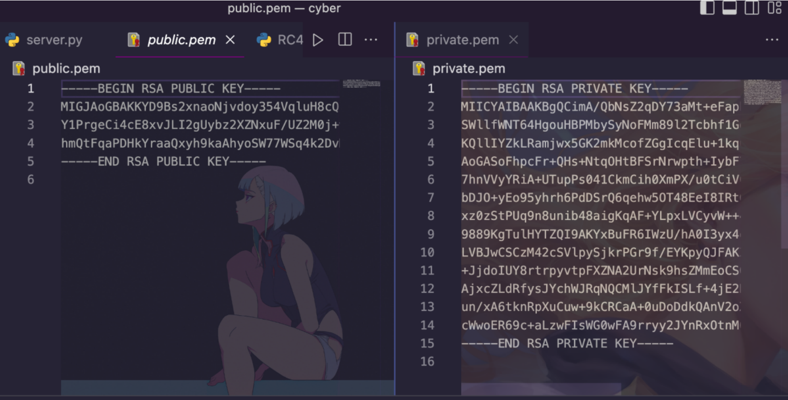
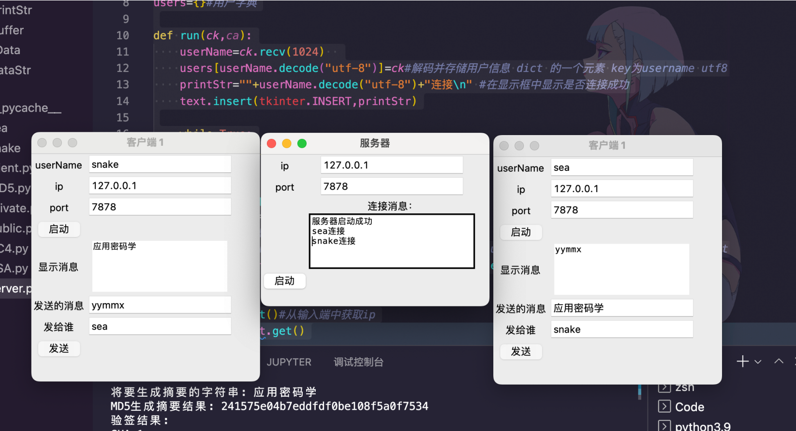

# 功能介绍
通过学习密码学三大算法类别(非对称 `rsa`、对称 `rc4`、摘要 `md5`),用python借助一些库简单实现了一个具有 **双向认证** **信息保密** 以及 **确保信息完整性** 的密码学综合系统。
# 通信加解密流程图

# 程序架构图

# 演示
通信

日志

公私钥

# 使用运行

## 安装依赖

使用前仅需 `pip install rsa` 安装rsa非对称加密算法模块

## 使用过程

1. 先启动服务器 `python server.py` 便会跳出ui弹窗（python内置的UI组件实现） 在本机自己指定一个端口（ 例如ip 127.0.0.1 port 7878 点击启动） 进行监听
2. 然后开两个客户端程序 `python client.py` 并取好用户名 分别去连接服务器程序监听的端口  （点击启动），服务端程序会显示已连接的客户端用户名
3. 至此两个客户端就可以进行通信了 （指定发给谁和发送消息的具体内容然后点击发送）

